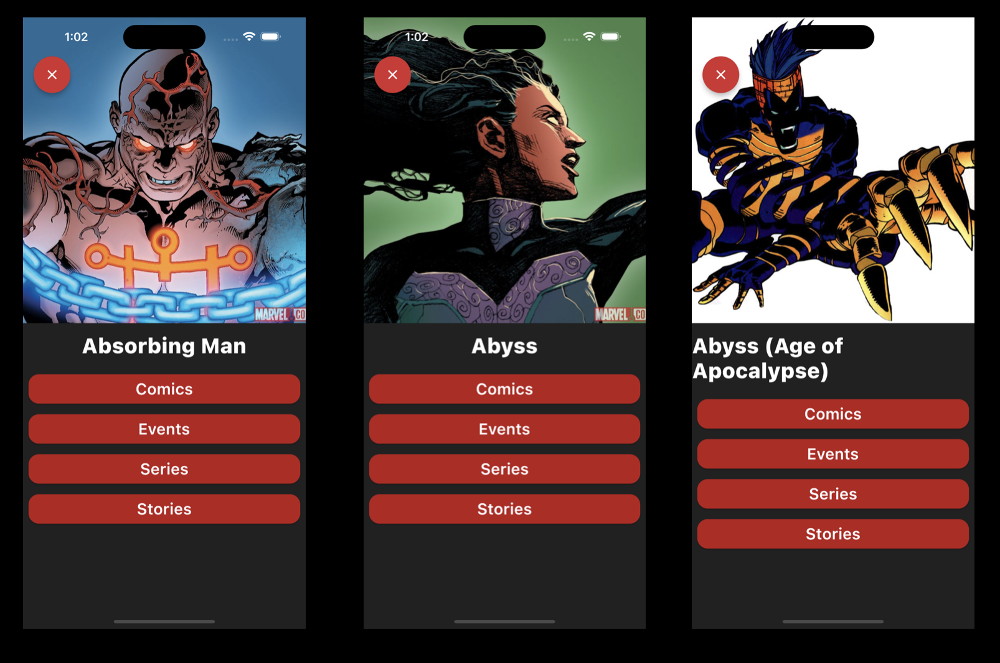

# wordle_mobile

A new Flutter project created for **wordle_mobile**.

## About this project.

This project use:

- Getx RouteManagement.
- Getx StateManagement.
- Getx GetConnect.
- Getx DependencyManagement.





### How to run the project.

```shell
flutter pub get
```

#### Useful commands.

```shell
flutter clean
flutter pub get
```
